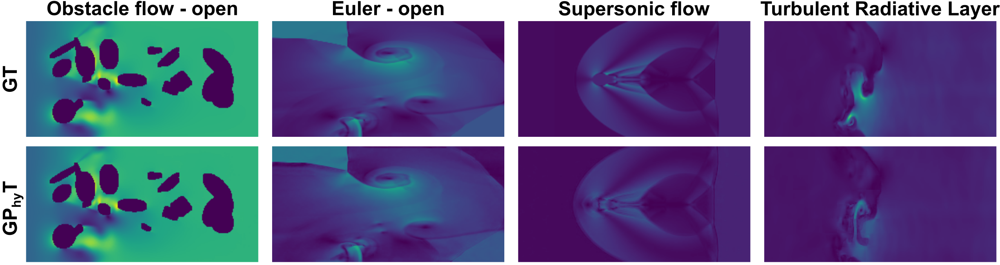

# Towards a Physics Foundation Model

Paper: https://arxiv.org/abs/2509.13805

Blog post if you want to see some cool results: [blog link]

Weights: [huggingface link]

## Introduction

This repository contains the official implementation of the **General Physics Transformer (GP<sub>hy</sub>T)**, a foundation model for physics simulation presented in our paper (under review) "Towards a Physics Foundation Model."

### What is GP<sub>hy</sub>T?

hy</sub>T Architecture">

*Architecture overview: GP<sub>hy</sub>T combines a transformer-based neural differentiator with numerical integration, enabling robust and generalizable physics simulation.*

GP<sub>hy</sub>T represents a paradigm shift in physics-aware machine learning—moving from specialized, single-physics models to a unified "**train once, deploy anywhere**" approach. Our model demonstrates three groundbreaking capabilities:

**Multi-Physics Mastery**: A single model effectively simulates diverse physical systems including fluid-solid interactions, shock waves, thermal convection, and multi-phase dynamics—**without being explicitly told the governing equations**.

**Zero-Shot Generalization**: Through in-context learning, GP<sub>hy</sub>T adapts to entirely unseen physical systems and boundary conditions by inferring the underlying dynamics from input prompts alone.

**Long-Term Stability**: Maintains physically plausible predictions through extended 50-timestep autoregressive rollouts.

### Key Results

- **29× better performance** than specialized neural operators (FNO) on multi-physics benchmarks
- **Zero-shot adaptation** to new boundary conditions and entirely novel physics
- **1.8TB training corpus** spanning 8 distinct physical systems
- **Stable long-term predictions** with consistent physical behavior

The image below showcases GP<sub>hy</sub>T's ability to predict the evolution of physical systems it has never seen during training, purely from context.

hy</sub>T generalization capabilities">


### Why This Matters

Current physics-aware ML models are fundamentally limited to single, narrow domains and require retraining for each new system. GP<sub>hy</sub>T breaks this barrier by learning generalizable physical principles from diverse simulation data, opening the path toward a universal physics foundation model that could:

- **Democratize** access to high-fidelity simulations
- **Accelerate** scientific discovery across disciplines
- **Eliminate** the need for specialized solver development for each new problem

## Installation

We are using conda and pip to manage the dependencies.

```bash
conda create -n gphyt python=3.12
conda activate gphyt
pip install torch torchvision --index-url https://download.pytorch.org/whl/cu128
pip install einops h5py imageio ipykernel matplotlib neuraloperator pandas the-well wandb dotenv torchtnt pytest
pip install -e .
```

## Datasets

This study uses both self-made datasets and datasets from [The Well](https://polymathic-ai.org/the_well/).
The well-datasets can be downloaded like this:

```bash
the-well-download --base-path /home/gphyt --dataset turbulent_radiative_layer_2D
```

All datasets are formatted according to the-well [format](https://polymathic-ai.org/the_well/data_format/).
In general, the data are hdf5 files, one for each parameter set.
Inside the hdf5 files, the features are stored in the t0 (scalar), t1 (vector), and t2 (tensor) groups.
The arrays are shaped as (n_trajectories, n_steps, x, y) or for vector features as (n_trajectories, n_steps, x, y, 2).

### Physics

The datasets cover the following physics:

- Incompressible Navier-Stokes
- Compressible Navier-Stokes
- Flow with heat transfer
- Obstacles and wall interactions
- Two-phase flow
- Natural convection
