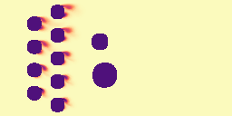

<div class="gif-grid-3x3-nospace">



</div>

Paper: [arXiv](https://arxiv.org/abs/2509.13805)

## TLDR

In our paper "Towards a Physics Foundation Model", we introduce a transformer-based model designed to learn multiple physical systems. Our goal is to create a unified framework — a Physics Foundation Model — that can understand and predict physical phenomena across multiple scales and domains. Importantly, such a foundation model must be
capable of generalizing to new physical systems and conditions not seen during training. We compare our model's performance against traditional physics-surrogate models and demonstrate its ability to generalize to unseen scenarios.


## A Foundation Model for Physics — Why?

> "A Foundation Model exhibits wide generalization capability – without retraining"

Large Language Models (LLMs), especially their newest version of Reasoning Models, are extremely versatile. They can write poems, give summaries, translate, code and solve math problems. This is not only due to their vast training data, but also their ability of in-context and zero-shot learning.
This means, that they can adapt to new tasks without any additional training, simply by following their instructions. Think for example of this prompt:

```
Take this paper and
- Translate it to German.
- Remove all em-dashes.
- Paraphrase the last section.
- Check all math formulas.

Return Latex code!
```
This particular task (the paper and my instructions) is something the model has never seen before, yet it can solve it fantastically well.

**We want something similar for physics!** We want a model that learned all possible physical principles and can apply them to new scenarios, without any retraining.
Importantly, we are talking about a replacement of traditional physics-simulators, not LLMs. These models would not output physical equations (text), but physical fields (numerical data), for example the velocity field of a fluid flow.
Current physics-aware machine learning (PAML) models are typically narrow models, and for good reason, or actually two reasons:

1. Data is scarce, since simulations and experiments are expensive as hell. Espcially 3D simulations take weeks to months on a supercomputer. Also, the physical world is extremely diverse, and it is almost impossible to cover all scenarios.
2. Predicting physics is extremely hard, even for numerical solvers. Physic simulations are done time-step by time-step, and small errors accumulate quickly. Machine learning models typically struggle with these errors, leading to unphysical results.

## What is GPHYT?

GPHYT is a transformer-based model designed to learn universal physical principles from diverse datasets. Unlike domain-specific models, our goal is to create a unified framework that can:

- Understand physics across multiple scales (quantum to cosmic)
- Transfer knowledge between related physical systems
- Generate predictions for novel scenarios
- Assist in scientific discovery


## What's Next

Our roadmap includes:
